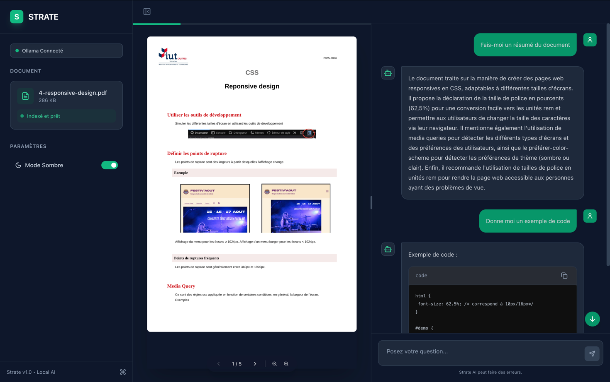

# Strate 📚

**Strate** est une application d'analyse documentaire intelligente (RAG) qui tourne **100% en local**.
Elle vous permet de discuter avec vos fichiers PDF, d'en extraire des résumés, du code ou des explications, sans qu'aucune donnée ne quitte votre machine.



## ✨ Fonctionnalités

- **🔒 100% Local & Privé** : Utilise Ollama pour faire tourner les modèles d'IA sur votre ordinateur. Aucune clé API requise.
- **⚡️ Réponses en Streaming** : L'IA répond en temps réel (effet machine à écrire).
- **📄 Split View** : Lisez votre PDF à gauche tout en discutant avec l'IA à droite.
- **🧠 Mémoire de Conversation** : L'IA se souvient du contexte de vos questions précédentes.
- **🎨 UI/UX Premium** :
  - Mode Sombre / Clair.
  - Animations fluides (Framer Motion).
  - Sidebar rétractable.
  - Rendu Markdown avec coloration syntaxique pour le code.
- **🛠 Outils Avancés** :
  - Bouton "Copier le code".
  - Raccourcis clavier (`⌘K`, `⌘B`, `Esc`).
  - Indicateur de santé Ollama en temps réel.

## 🛠 Stack Technique

- **Framework** : [Next.js 14](https://nextjs.org/) (App Router, Server Actions).
- **IA / LLM** : [Ollama](https://ollama.com/) (Modèles : `mistral` & `nomic-embed-text`).
- **Orchestration** : [LangChain.js](https://js.langchain.com/).
- **Vector Store** : En mémoire (MemoryVectorStore).
- **Styling** : [Tailwind CSS](https://tailwindcss.com/), `sonner` (Toasts), `lucide-react` (Icônes).
- **PDF** : `react-pdf` pour le rendu, `pdf-parse` pour l'ingestion.

## 🚀 Installation

### 1. Pré-requis : Ollama

Ce projet nécessite **Ollama** pour fonctionner localement.

1. Téléchargez et installez Ollama depuis [ollama.com](https://ollama.com).
2. Lancez Ollama.
3. Téléchargez les modèles nécessaires via votre terminal :

```bash
# Modèle de chat (génération de texte)
ollama pull mistral

# Modèle d'embedding (vectorisation du PDF)
ollama pull nomic-embed-text
```

### 2. Installation du projet

Clonez le dépôt et installez les dépendances :

```bash
git clone https://github.com/votre-username/strate.git
cd strate
npm install
```

### 3. Lancement

Lancez le serveur de développement :

```bash
npm run dev
```

Ouvrez [http://localhost:3000](http://localhost:3000) dans votre navigateur.

## ⌨️ Raccourcis Clavier

| Raccourci | Action |
|-----------|--------|
| `⌘` + `B` | Ouvrir / Fermer la barre latérale |
| `⌘` + `K` | Réinitialiser la conversation (Nouveau fichier) |
| `Esc` | Arrêter la génération en cours |
| `?` | Afficher l'aide |

## 🐛 Dépannage

- **Erreur "Ollama déconnecté"** : Assurez-vous que l'application Ollama tourne en arrière-plan ou lancez `ollama serve` dans un terminal.
- **Erreur "Fetch failed"** : Vérifiez que vous avez bien téléchargé les modèles (`mistral` et `nomic-embed-text`).
- **Le PDF ne s'affiche pas** : Vérifiez que le fichier n'est pas corrompu. L'application supporte les PDF standards.

## 📄 Licence

Ce projet est sous licence MIT.
